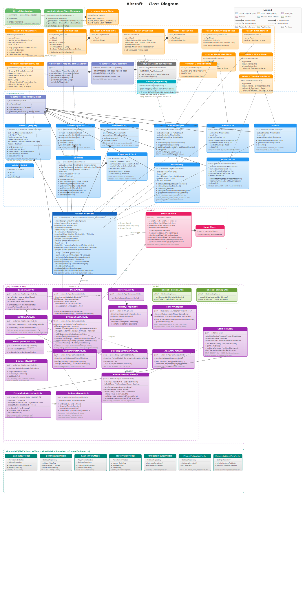

# Aircraft

Aircraft is a Kotlin Android vertical-scrolling shooter built on a custom `SurfaceView` + Canvas game loop. The current app combines a first-launch privacy gate, a two-screen onboarding flow, 10 time-based combat stages, 9 interleaved puzzle gates (one after each non-final combat stage), boss fights, collectible power-ups, a QR code scan/generate utility, local save/resume support, localized About screens, and debug-only developer tools. The canonical repository is `https://github.com/tobecrazy/Aircraft`.

## Project Architecture


> For the full UML class diagram, see [class_diagram.svg](class_diagram.svg). For detailed developer documentation, see [DOCUMENT.md](DOCUMENT.md). For release history, see [CHANGELOG.md](CHANGELOG.md) or the compatibility alias [ChangeLogs.md](ChangeLogs.md).

## Class Diagram



### Package Overview

| Package | Color | Key Classes | Responsibility |
|---------|-------|-------------|----------------|
| `common/` | Green | `AircraftApplication`, `GameStateManager` | App lifecycle, game-state broadcasting via SharedFlow |
| `data/` | Orange | `PlayerAircraft`, `EnemyState`, `BossState`, `RedEnvelopeState`, `RocketState`, `MedicalKitState`, `ShieldState`, `TimeFreezeState`, `PlayerGameData`, `PlayerGameDataDao`, `AppDatabase`, `GameState`, `GameDifficulty`, `AircraftConstants`, `ImageDetails`, `ImageDetailsSource` | Data models, Room persistence, game state enums, HUD constants, image details contracts |
| `ui/` (Game Engine) | Blue | `DrawBaseObject`, `Aircraft`, `DrawBackground`, `DrawHeader`, `Enemies`, `BossEnemy`, `RedEnvelopes`, `MedicalKits`, `Shields`, `TimeFreezes`, `ExplosionEffect`, `GameCoreView`, `GameHudFormatter` | 30 FPS rendering, collision detection, level progression, HUD formatting |
| `viewmodel/` | Teal | `GameViewModel`, `SettingsViewModel`, `LaunchViewModel`, `HistoryViewModel`, `OnboardingViewModel`, `PrivacyPolicyViewModel`, `DevelopSettingsViewModel`, `AboutAircraftViewModel`, `AboutMeViewModel`, `DeviceInfoViewModel`, `QRCodeToolViewModel`, `RichTextEditorViewModel`, `ShowImageDetailsViewModel` | MVVM mediation between Views and Repositories/DAOs |
| `gui/` (Presentation) | Purple | `PrivacyPolicyAcceptActivity`, `OnboardingActivity`, `LaunchActivity`, `MainActivity`, `PuzzleActivity`, `HistoryActivity`, `HistoryFragment`, `HistoryAdapter`, `SettingsActivity`, `QRCodeToolActivity`, `ShowImageDetailsActivity`, `StarFieldView` | Activity screens, navigation, ViewBinding + Compose UI |
| `service/` | Pink | `MusicService`, `MusicBinder` | BGM (MediaPlayer) + SFX (SoundPool) bound service |
| `providers/` | Gray | `DatabaseProvider`, `SettingsRepository` | Singleton DB provider, SharedPreferences wrapper |
| `utils/` | Light green | `ScreenUtils`, `BitmapUtils`, `HallOfHeroesNameUtils` | Screen metrics, bitmap utilities, name formatting |

### Key Relationships

- `GameCoreView` composes all game-engine objects (`Aircraft`, `Enemies`, `DrawBackground`, `DrawHeader`, `BossEnemy`, etc.) and orchestrates the 30 FPS loop
- All drawable game objects extend the abstract `DrawBaseObject` (provides `onDraw`, `updateGame`, `getEnemyBounds`)
- UI layer classes hold references to their corresponding data state classes (e.g., `Enemies` → `EnemyState`, `BossEnemy` → `BossState`)
- Activities delegate to ViewModels for data access: `MainActivity` → `GameViewModel`, `SettingsActivity` → `SettingsViewModel`, `LaunchActivity` → `LaunchViewModel`, etc.
- ViewModels mediate access to `SettingsRepository` and `PlayerGameDataDao` — Activities never access repositories or DAOs directly
- `MainActivity` binds `MusicService` and collects `GameStateManager.gameState` flow
- `DatabaseProvider` singleton creates `AppDatabase`, which exposes `PlayerGameDataDao` operating on `PlayerGameData` entities
- `SettingsRepository` maps difficulty strings to `GameDifficulty` enum values with `fireRateMultiplier`

## Highlights

- Custom 30 FPS `SurfaceView` engine with no third-party game framework
- Green tactical in-game shell for `MainActivity` with a mission-briefing card, pause overlay, and themed end-of-run dialogs
- First-launch privacy acceptance flow with cinematic `StarFieldView`
- Compose-powered two-page onboarding carousel with animated entrance effects
- 10 combat levels with boss fights, scaling kill targets, and randomized scrolling backgrounds
- Puzzle-gate flow: after clearing combat levels 1-9, players must clear the same-numbered puzzle level before entering the next combat level
- Four power-up systems: red envelopes/rockets, medical kits, shields, and time freezes
- Difficulty presets that adjust fire rate: Easy (`1.2x`), Normal (`1.0x`), Hard (`0.8x`)
- Room persistence for leaderboard data and saved progress, including jet selection and difficulty
- Leaderboard top record highlighting with a medal/star badge and gold first-place styling
- History screen with Chinese ink-painting background (`launch_background.jpeg`)
- Compose-powered About Me and Onboarding screens with localized copy and smooth transition animations
- Coil-based network image loading with crossfade animations (`AsyncImage` for Compose, `ImageView.load()` for Views)
- Image details viewer (`ShowImageDetailsActivity`) supporting both local drawables and network URLs with download capability
- Rich-text preview image tap support: clicking an image in `RichTextEditorActivity` opens `ShowImageDetailsActivity`
- Utility screens for history, QR code scanning/generation/save-to-device, image details, device info, about-aircraft, about-me, privacy policy, and debug-only developer settings
- Firebase Analytics and Crashlytics integration
- English and Chinese localization

## Gameplay

- **Progression**: 10 combat levels with timers decreasing from 300s to 120s, plus 9 puzzle levels gated between combat levels
- **Boss fights**: every level ends with a boss that scales from 1,000 HP to 1,900 HP
- **Controls**: drag the plane to move; bullets auto-fire during play
- **Power-ups**:
  - Red envelopes take 3 hits, then launch rockets with AoE damage
  - Medical kits restore the player to full HP
  - Shields grant temporary invincibility with a blink indicator
  - Time freezes can freeze enemies or the player for 5 seconds depending on who collects them
- **Progress persistence**: saves now persist mode-aware progress (`AIR_BATTLE` or `PUZZLE`) and resume into the matching mode with puzzle score included in total score
- **Debug flow**: debug builds expose Developer Settings, test-crash tooling, and a hidden invincible-mode toggle

## Features

- 12-way per-frame collision system covering enemies, bullets, bosses, rockets, and pickups
- In-game briefing panel shows live launch context including sector, difficulty profile, and selected airframe
- Particle-based explosion effects with flash, fireball, debris, and smoke phases
- Screen shake, red damage flash, and low-health vignette effects
- Background music via `MediaPlayer` and combat SFX via `SoundPool`
- Jet selection with 4 playable plane sprites and saved `jet_plane_index`
- QR code utility with live camera scan, gallery image import, rich-text encoding input, framed preview output, and long-press save to device
- Device information screen with CPU, memory, disk, battery, and network telemetry
- Robolectric coverage for onboarding, privacy gate, QR tool flows, About Me Compose UI wiring, leaderboard styling, string parity, and gameplay formulas

## Project Structure

```text
app/src/main/java/com/young/aircraft/
├── common/
│   ├── AircraftApplication.kt          # Application entry point; emits LOW_MEMORY events
│   └── GameStateManager.kt             # SharedFlow game-state broadcaster + debug invincible flag
├── data/
│   ├── AppDatabase.kt                  # Room database (v2030) + migrations
│   ├── PlayerGameData.kt               # Saved run entity
│   ├── PlayerGameDataDao.kt            # Leaderboard/save DAO
│   ├── PlayerAircraft.kt               # Player HP and damage model
│   ├── EnemyState.kt                   # Enemy position and bullet state
│   ├── BossState.kt                    # Boss HP, bombs, and sprite state
│   ├── RedEnvelopeState.kt             # Red envelope pickup state
│   ├── RocketState.kt                  # Rocket projectile state
│   ├── MedicalKitState.kt              # Medical kit pickup state
│   ├── ShieldState.kt                  # Shield pickup state
│   ├── TimeFreezeState.kt              # Time-freeze pickup state
│   ├── GameDifficulty.kt               # EASY/NORMAL/HARD enum with fireRateMultiplier
│   ├── AircraftConstants.kt            # HUD labels/colors, intent extras, URLs, privacy asset paths
│   ├── GameState.kt                    # PLAYING / PAUSED / GAME_OVER / LEVEL_COMPLETE / GAME_WON / LOW_MEMORY
│   ├── ImageDetails.kt                 # Image details contract (local resource or network URL)
│   └── ImageDetailsSource.kt           # Sealed class for image source types (Local, Network)
├── gui/
│   ├── PrivacyPolicyAcceptActivity.kt  # Launcher privacy gate
│   ├── OnboardingActivity.kt           # Compose-based onboarding carousel with HorizontalPager
│   ├── LaunchActivity.kt               # Main menu, jet selection, continue-game dialog
│   ├── MainActivity.kt                 # Game host, tactical overlay shell, pause flow, dialogs, and DB save flow
│   ├── HistoryActivity.kt              # History screen container
│   ├── HistoryFragment.kt              # Leaderboard fragment
│   ├── HistoryAdapter.kt               # RecyclerView adapter for saved runs
│   ├── SettingsActivity.kt             # Difficulty, sound, and navigation hub
│   ├── QRCodeToolActivity.kt           # QR scan/generate utility with camera preview, gallery import, save-to-device, and rich-text encoding
│   ├── RichTextEditorActivity.kt       # DEBUG rich-text editor with WebView preview; preview image taps open ShowImageDetailsActivity
│   ├── ShowImageDetailsActivity.kt     # Image details viewer (local drawable or network URL) with download capability
│   ├── DevelopSettingsActivity.kt      # Debug-only crash/invincibility tools
│   ├── DeviceInfoActivity.kt           # Live system monitor
│   ├── AboutAircraftActivity.kt        # Project overview, GitHub link, and clickable project image viewer
│   ├── AboutMeActivity.kt              # Compose-based developer profile and project details screen
│   ├── PrivacyPolicyActivity.kt        # Standalone privacy policy viewer
│   └── StarFieldView.kt                # Animated cinematic background
├── providers/
│   ├── DatabaseProvider.kt             # Singleton Room provider
│   └── SettingsRepository.kt           # SharedPreferences-backed privacy/difficulty/install-id store
├── service/
│   └── MusicService.kt                 # Bound BGM + SFX playback service
├── ui/
│   ├── GameCoreView.kt                 # Main game loop and collision orchestration
│   ├── DrawBaseObject.kt               # Base drawable/update contract
│   ├── DrawBackground.kt               # Mirrored seamless background renderer
│   ├── DrawHeader.kt                   # Two-row HUD: mission/hull cards top, timer below
│   ├── Aircraft.kt                     # Player sprite and bullet system
│   ├── Enemies.kt                      # Enemy spawning, movement, and bullets
│   ├── BossEnemy.kt                    # Boss AI, bombs, and scaling HP
│   ├── RedEnvelopes.kt                 # Rocket power-up and explosion handling
│   ├── MedicalKits.kt                  # HP pickup spawning and lifetime rules
│   ├── Shields.kt                      # Shield pickup spawning and lifetime rules
│   ├── TimeFreezes.kt                  # Freeze pickup spawning and 5s freeze logic
│   ├── ExplosionEffect.kt              # Particle explosion effect
│   └── GameHudFormatter.kt             # HUD data formatting (time, health %, score)
├── utils/
│   ├── BitmapUtils.kt                  # Bitmap loading, scaling, mirroring, rotation
│   ├── HallOfHeroesNameUtils.kt        # Hero-name formatting and anonymous fallback logic
│   └── ScreenUtils.kt                  # Screen metrics and dp/sp conversions
└── viewmodel/
    ├── GameViewModel.kt                # Save/load game, sound prefs, player ID (MainActivity)
    ├── SettingsViewModel.kt            # Difficulty + sound toggles StateFlow (SettingsActivity)
    ├── SettingsUiState.kt              # UI state data class for settings screen
    ├── LaunchViewModel.kt              # Saved-game check and delete (LaunchActivity)
    ├── HistoryViewModel.kt             # Leaderboard data loading and deletion (HistoryFragment)
    ├── HistoryUiState.kt               # UI state data class for history screen
    ├── OnboardingViewModel.kt          # Onboarding completion gate (OnboardingActivity)
    ├── PrivacyPolicyViewModel.kt       # Privacy acceptance gate (PrivacyPolicyAcceptActivity)
    ├── DevelopSettingsViewModel.kt     # Invincible mode toggle (DevelopSettingsActivity)
    ├── AboutAircraftViewModel.kt       # Project info StateFlow (AboutAircraftActivity)
    ├── AboutAircraftUiState.kt         # UI state for about-aircraft screen
    ├── AboutMeViewModel.kt             # Developer profile data (AboutMeActivity)
    ├── DeviceInfoViewModel.kt          # CPU/memory/disk/network telemetry (DeviceInfoActivity)
    ├── DeviceInfoUiState.kt            # UI state for device info screen
    ├── QRCodeToolViewModel.kt          # QR encode/decode logic (QRCodeToolActivity)
    ├── QRCodeToolUiState.kt            # UI state for QR tool screen
    ├── RichTextEditorViewModel.kt      # Edit/preview mode state (RichTextEditorActivity)
    ├── ShowImageDetailsViewModel.kt    # Image details display logic (ShowImageDetailsActivity)
    └── ShowImageDetailsUiState.kt      # UI state for image details screen
```

## Tests

`app/src/test` includes:

- data-model tests for gameplay and persistence state classes
- `GameCoreViewFormulaTest` for level duration and kill-target math
- `HistoryAdapterTest` for first-place badge visibility and gold score styling
- `QRCodeToolActivityTest` for scan/generate screen state, bottom-sheet result dialog, save-to-device flow, gallery pick button, and Settings navigation
- `AboutMeActivityTest` for localized About Me copy, repo URL rendering, and back navigation
- `MainActivityTest` for tactical overlay behavior, mission-briefing chips, and low-memory pause handling
- `DrawBackgroundTest` for seamless mirrored tile coverage
- `OnboardingActivityTest` and `PrivacyPolicyAcceptActivityTest` for first-run flow behavior
- `LaunchActivityTest` for saved-game detection, continue/new-game dialog, and jet selection
- `DevelopSettingsViewModelTest`, `PrivacyPolicyViewModelTest`, `OnboardingViewModelTest`, `LaunchViewModelTest` for ViewModel unit coverage
- `PlayerGameDataTest` for timestamp-aware data-class behavior
- `StarFieldViewTest` for the animated onboarding/privacy background
- `StringResourceTest` for locale parity and resource usage coverage

Instrumented tests belong in `app/src/androidTest`.

## Game Assets

| Category | Count | Details |
|----------|-------|---------|
| Enemy sprites | 15 | `enemy_1.png` to `enemy_15.png` |
| Boss sprites | 7 | `boss_1.png` to `boss_7.png` |
| Missile sprites | 3 | `missile_1.png` to `missile_3.png` |
| Jet planes | 4 | `jet_plane_1.png` to `jet_plane_4.png` |
| Red envelopes | 2 | `red_box_1.png`, `red_box_2.png` |
| Medical kits | 2 | `red_heart_1.png`, `red_heart_2.png` |
| Shields | 3 | `shield_1.png`, `shield_2.png`, `shield_3.png` |
| Time freezes | 3 | `timer_1.png`, `timer_2.png`, `timer_3.png` |
| Rocket | 1 | `rocket.png` |
| Backgrounds | 3 | `background.jpg`, `background_1.jpg`, `background_2.jpg` |
| Audio | 6 | 2 BGM tracks + fire/hit/enemy-hit/game-over SFX |
| Localization | 2 | English (`values/`) + Chinese (`values-zh/`) |

## Level Progression

| Level | Time Limit | Required Kills | Enemies/Row | Boss HP |
|-------|-----------|----------------|-------------|---------|
| 1 | 300s | 100 | 6 | 1,000 |
| 2 | 280s | 110 | 7 | 1,100 |
| 3 | 260s | 120 | 8 | 1,200 |
| 4 | 240s | 130 | 9 | 1,300 |
| 5 | 220s | 140 | 10 | 1,400 |
| 6 | 200s | 150 | 11 | 1,500 |
| 7 | 180s | 160 | 12 | 1,600 |
| 8 | 160s | 170 | 13 | 1,700 |
| 9 | 140s | 180 | 14 | 1,800 |
| 10 | 120s | 190 | 15 | 1,900 |

## Requirements

- **Version**: `1.2.3`
- **Android Studio**: Meerkat (`2024.3.1`) or later
- **Compile SDK**: `37`
- **Min SDK**: `30`
- **Target SDK**: `36`
- **Java**: `17`
- **Gradle Wrapper**: `9.4.1`
- **Android Gradle Plugin**: `9.1.1`

## Build

```bash
./gradlew assembleDebug          # Build debug APK
./gradlew assembleRelease        # Build release APK
./gradlew test                   # Run unit and Robolectric tests
./gradlew connectedAndroidTest   # Run instrumented tests (device/emulator required)
./gradlew lint                   # Run Android lint
./gradlew clean                  # Clean build outputs
```

## Setup

1. Clone the repository:
   ```bash
   git clone https://github.com/tobecrazy/Aircraft.git
   cd Aircraft
   ```
2. Open the project in Android Studio.
3. Sync Gradle and run on a device or emulator with Android 11+.

## License

This project is open source and available for educational purposes.
