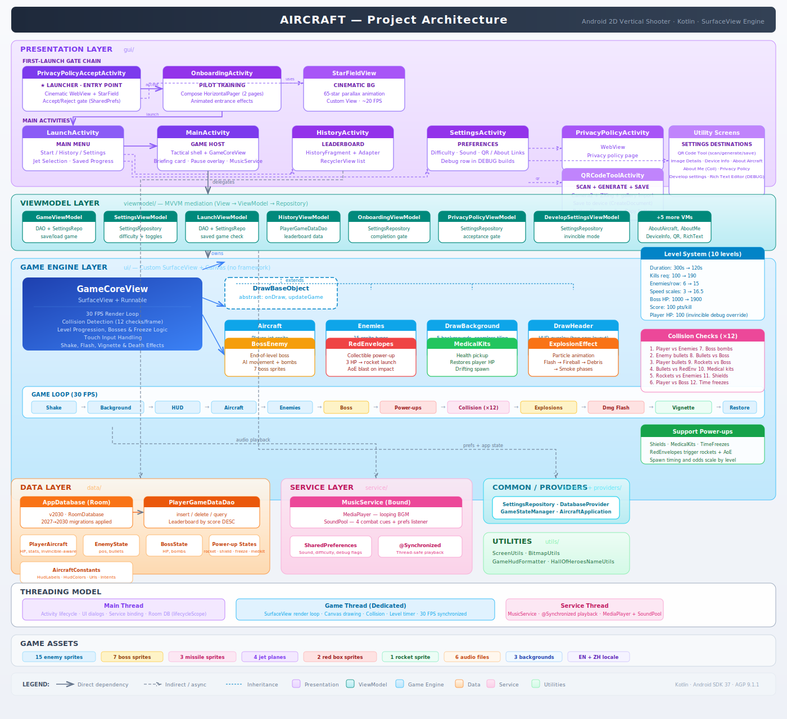

# Aircraft

A 2D vertical-scrolling shooter game for Android, written in Kotlin. Control a jet plane, fire bullets, destroy waves of enemies, collect power-ups, and defeat bosses across 10 increasingly difficult levels.

## Project Architecture



> For the full UML class diagram, see [class_diagram.svg](class_diagram.svg). For detailed developer documentation, see [DOCUMENT.md](DOCUMENT.md).

## Gameplay

- **10 Levels** with time-based progression: 300s down to 120s per level
- **Boss Fights**: Each level ends with a boss that has AI movement, bomb attacks, and scaling HP (1000–1900)
- **Power-Ups**: Red envelopes (3 hits to open → rocket launch → AoE blast) and medical kits (HP restore)
- **Touch Controls**: Drag to move, bullets fire automatically every 4 frames
- **Scaling Difficulty**: More enemies, faster spawns, tighter bullet spacing each level
- **Scoring**: 100 pts/kill, cumulative across all levels in a session

## Features

- Custom SurfaceView game engine at 30 FPS — no third-party game framework
- 9-way per-frame collision detection system
- Particle-based explosion effects (flash, fireball, debris, smoke phases)
- Screen shake, damage flash, and low-health vignette effects
- Background music (MediaPlayer) + sound effects (SoundPool, 5 streams)
- Room database persistence with leaderboard
- 4 selectable jet planes, 15 enemy types, 5 boss sprites
- Localization: English and Chinese

## Project Structure

```
app/src/main/java/com/young/aircraft/
├── common/
│   ├── AircraftApplication.kt          # Application entry point
│   └── GameStateManager.kt            # Singleton: broadcasts GameState via SharedFlow
│
├── data/                                # ── Data Layer ──
│   ├── AppDatabase.kt                   # Room database singleton (v2027)
│   ├── PlayerGameData.kt               # Entity: player_game_data table
│   ├── PlayerGameDataDao.kt            # DAO: CRUD for game records
│   ├── Aircraft.kt                      # Data model: player HP & stats
│   ├── EnemyState.kt                   # Data model: enemy position & bullets
│   ├── BossState.kt                    # Data model: boss HP, phase, movement
│   ├── RedEnvelopeState.kt             # Data model: red envelope state
│   ├── RocketState.kt                  # Data model: rocket projectile state
│   ├── MedicalKitState.kt             # Data model: medical kit state
│   └── GameState.kt                    # Enum: game state (PLAYING, PAUSED, LOW_MEMORY…)
│
├── gui/                                 # ── Presentation Layer ──
│   ├── LaunchActivity.kt               # Home screen (Start / History / Settings)
│   ├── MainActivity.kt                 # Game host, binds MusicService, saves to DB
│   ├── HistoryActivity.kt              # Leaderboard screen container
│   ├── HistoryFragment.kt              # Game history list (RecyclerView)
│   ├── HistoryAdapter.kt               # RecyclerView adapter for records
│   ├── SettingsActivity.kt             # Sound & privacy preferences
│   └── PrivacyPolicyActivity.kt        # Privacy policy (WebView)
│
├── ui/                                  # ── Game Engine Layer ──
│   ├── GameCoreView.kt                 # SurfaceView: game loop, collision, levels
│   ├── DrawBaseObject.kt               # Abstract base for drawable objects
│   ├── Aircraft.kt                      # Player jet: rendering & bullet firing
│   ├── Enemies.kt                       # Enemy spawning, movement & bullets
│   ├── BossEnemy.kt                    # Boss AI, bombs, death sequence
│   ├── RedEnvelopes.kt                 # Red envelope power-up & rocket system
│   ├── MedicalKits.kt                  # Health pickup collectibles
│   ├── DrawBackground.kt               # Seamless scrolling background
│   ├── DrawHeader.kt                   # HUD: level, HP bar, timer, kills
│   └── ExplosionEffect.kt             # Particle-based death explosion
│
├── providers/                           # ── Providers ──
│   └── DatabaseProvider.kt             # Database instance provider
│
├── service/                             # ── Service Layer ──
│   └── MusicService.kt                 # Bound service: BGM + SFX playback
│
├── viewmodel/                           # ── ViewModel Layer ──
│   └── MainViewModel.kt                # LiveData for service readiness
│
└── utils/                               # ── Utilities ──
    ├── ScreenUtils.kt                   # Screen dimensions, dp/sp/px conversion
    └── BitmapUtils.kt                   # Bitmap loading, resizing, rotation
```

## Game Assets

| Category | Count | Details |
|----------|-------|---------|
| Enemy sprites | 15 | `enemy_1.png` – `enemy_15.png` |
| Boss sprites | 5 | `boss_1.png` – `boss_5.png` |
| Missile sprites | 3 | `missile_1.png` – `missile_3.png` |
| Jet planes | 4 | `jet_plane_1.png` – `jet_plane_4.png` (selectable) |
| Red envelopes | 3 | `red_box_1.png`, `red_box_2.png`, `red_box_3.png` |
| Rocket | 1 | `rocket.png` |
| Backgrounds | 3 | `background.jpg`, `background_1.jpg`, `background_2.jpg` |
| Audio | 6 | 2 BGM tracks + fire, hit, enemy_hit, game_over SFX |
| Localization | 2 | English (default) + Chinese (`values-zh/`) |

## Level Progression

| Level | Time Limit | Required Kills | Enemies/Row | Boss HP |
|-------|-----------|----------------|-------------|---------|
| 1 | 300s | 100 | 6 | 1,000 |
| 2 | 280s | 110 | 7 | 1,100 |
| 3 | 260s | 120 | 8 | 1,200 |
| 4 | 240s | 130 | 9 | 1,300 |
| 5 | 220s | 140 | 10 | 1,400 |
| 6 | 200s | 150 | 11 | 1,500 |
| 7 | 180s | 160 | 12 | 1,600 |
| 8 | 160s | 170 | 13 | 1,700 |
| 9 | 140s | 180 | 14 | 1,800 |
| 10 | 120s | 190 | 15 | 1,900 |

## Requirements

- **Android Studio**: Meerkat (2024.3.1) or later
- **Compile SDK**: 36
- **Min SDK**: 30 (Android 11)
- **Target SDK**: 35
- **Java**: 17
- **Gradle**: 9.3.1 / AGP 9.1.0

## Build

```bash
./gradlew assembleDebug          # Build debug APK
./gradlew assembleRelease        # Build release APK
./gradlew test                   # Run unit tests
./gradlew connectedAndroidTest   # Instrumented tests (requires device/emulator)
./gradlew lint                   # Lint check
./gradlew clean                  # Clean build
```

## Setup

1. Clone the repository:
   ```bash
   git clone <repository-url>
   cd Aircraft
   ```
2. Open in Android Studio.
3. Sync Gradle and run on a device or emulator (API 30+).

## License

This project is open source and available for educational purposes.
