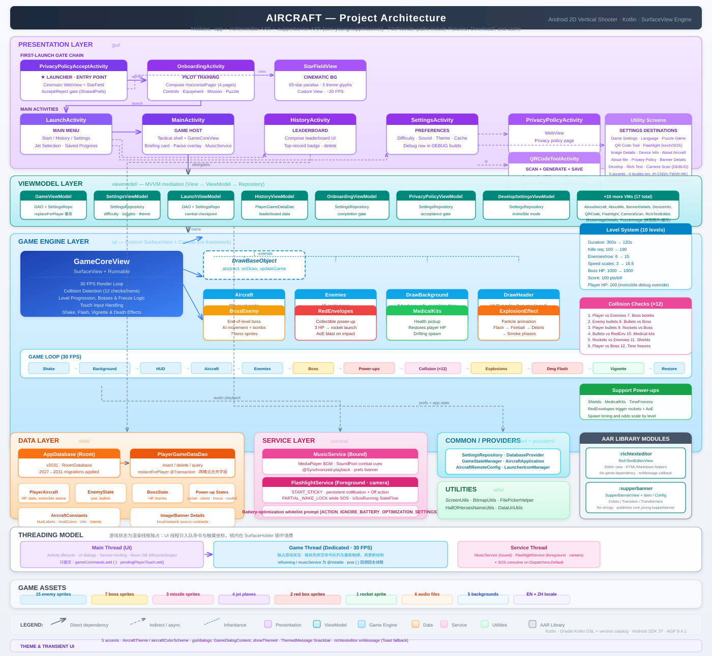
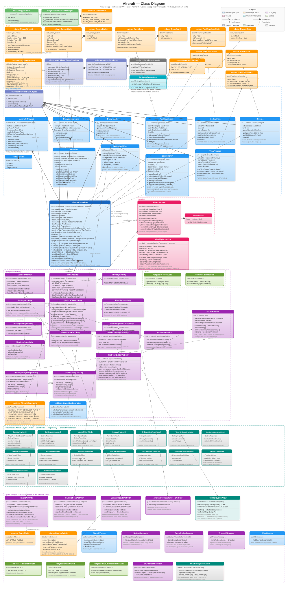

# Aircraft

Aircraft is a Kotlin Android vertical-scrolling shooter built on a custom `SurfaceView` + Canvas game loop. The current project includes the `:app` module plus two reusable Android library modules, `:richtexteditor` and `:supperbanner`, that can be built as AARs. The app combines a first-launch privacy gate, a four-screen onboarding flow, 10 time-based combat stages, a separate 10-level puzzle mode, boss fights, collectible power-ups, QR code and flashlight utilities, local progress saving, localized About screens, and debug-only developer tools. The canonical repository is `https://github.com/tobecrazy/Aircraft`.

## Download

Latest published release APK (V1.3.2):

- [app-release.apk](https://github.com/tobecrazy/Aircraft/releases/download/V1.3.2/app-release.apk)

All releases: <https://github.com/tobecrazy/Aircraft/releases>

> The app currently builds as `1.3.6` (`versionCode` 9); releases up to `V1.3.2` are on GitHub.

## Demo

<p align="center">
  
</p>

The demo above walks through the end-to-end player experience on a real device:

- **First-launch flow** — cinematic privacy gate over the animated `StarFieldView`, followed by the four-page Compose onboarding carousel: controls, field equipment, mission brief, and the standalone puzzle mode.
- **Launch hub** — jet selection, continue/new-game dialog when a saved run exists, and entry points to History, Settings, and the QR/Flashlight utilities.
- **Combat gameplay** — 30 FPS `SurfaceView` rendering with drag-to-move controls, auto-firing bullets, scrolling backgrounds, the two-row tactical HUD (mission/hull cards + countdown timer), and screen-shake/damage-flash feedback.
- **Power-ups in action** — red envelopes detonating into AoE rockets, medical kits restoring HP, shields granting blink-indicated invincibility, and time freezes locking enemies in place.
- **Boss fight** — end-of-level boss with bomb attacks, scaling HP, a two-phase attack pattern (single missile shots above half HP, a 5-way spread of red orbs below half HP), the multi-phase particle explosion, and a canvas-wide multi-burst fireworks show on defeat.
- **Puzzle mode** — Compose-based drag-and-drop picture puzzle with pinch zoom, auto-snapping, hints, and undo, opened separately from Settings (3×3 / 4×4 / 5×5 by difficulty).
- **Utility screens** — QR code scan/generate, flashlight with SOS and brightness control, device info telemetry, and the localized About / History screens.

## Project Architecture



> An interactive version of the architecture (theme, pan/zoom, guided views) is available at [docs/aircraft-architecture.html](docs/aircraft-architecture.html), generated from [docs/aircraft-arch.json](docs/aircraft-arch.json). For the full UML class diagram, see [class_diagram.svg](class_diagram.svg). For detailed developer documentation, see [DOCUMENT.md](DOCUMENT.md). For release history, see [ChangeLogs.md](ChangeLogs.md).

## Class Diagram



### Package Overview

| Package | Color | Key Classes | Responsibility |
|---------|-------|-------------|----------------|
| `common/` | Green | `AircraftApplication`, `GameStateManager` | App lifecycle, game-state broadcasting via SharedFlow |
| `data/` | Orange | `PlayerAircraft`, `EnemyState`, `BossState`, `RedEnvelopeState`, `RocketState`, `MedicalKitState`, `ShieldState`, `TimeFreezeState`, `PlayerGameData`, `PlayerGameDataDao`, `AppDatabase`, `SettingsRepository`, `GameState`, `GameMode`, `GameDifficulty`, `AircraftConstants`, `ImageDetails`, `ContactsRepository` | Data models, Room persistence, SharedPreferences repository, game state enums, HUD constants, image details contracts, device-contacts ContentResolver access |
| `ui/` (Game Engine) | Blue | `DrawBaseObject`, `Aircraft`, `DrawBackground`, `DrawHeader`, `Enemies`, `BossEnemy`, `BossFireworksEffect`, `RedEnvelopes`, `MedicalKits`, `Shields`, `TimeFreezes`, `ExplosionEffect`, `GameCoreView`, `GameHudFormatter` | 30 FPS rendering, collision detection, level progression, HUD formatting, boss-defeat fireworks |
| `richtexteditor/` | Blue-gray | `RichTextEditorView` | Reusable AAR library for rich-text input, toolbar formatting, Markdown/HTML helpers, and image-tap URL helpers |
| `supperbanner/` | Slate | `SupperBannerView`, `SupperBannerItem`, `SupperBannerImage`, `SupperBannerConfig`, `SupperBannerColors`, `SupperBannerIndicatorColors`, `SupperBannerEffect`, `SupperBannerTransition` | Reusable AAR library for the auto-playing banner carousel (ViewPager2 + Coil), with a host-settable color palette, ten configurable page transitions, and `maven-publish` release output |
| `viewmodel/` | Teal | `GameViewModel`, `SettingsViewModel`, `LaunchViewModel`, `HistoryViewModel`, `OnboardingViewModel`, `PrivacyPolicyViewModel`, `PuzzleImageViewModel`, `DevelopSettingsViewModel`, `CameraScanViewModel`, `RichTextEditorViewModel`, `AboutAircraftViewModel`, `AboutMeViewModel`, `DeviceInfoViewModel`, `QRCodeToolViewModel`, `FlashlightViewModel`, `BannerDetailsViewModel`, `ShowImageDetailsViewModel`, `ContactsViewModel` | MVVM mediation between Views and Repositories/DAOs |
| `gui/` (Presentation) | Purple | `PrivacyPolicyAcceptActivity`, `OnboardingActivity`, `LaunchActivity`, `MainActivity`, `GameHudScreen`, `PuzzleActivity`, `HistoryActivity`, `SettingsActivity`, `SettingsScreen`, `GameSettingsActivity`, `LanguageSettingsActivity`, `QRCodeToolActivity`, `FlashlightActivity`, `BannerDetailsActivity`, `ShowImageDetailsActivity`, `DevelopSettingsActivity`, `AndroidDevAssistantToolsActivity`, `CameraScanActivity`, `DeviceInfoActivity`, `AboutAircraftActivity`, `AboutMeActivity`, `PrivacyPolicyActivity`, `RichTextEditorActivity`, `ContactsActivity`, `StarFieldView`, `ThemedMessage`, `gui/dialogs/*` | Activity screens, navigation, Compose-only UI (no ViewBinding), themed dialogs/Snackbars |
| `service/` | Pink | `MusicService`, `MusicBinder`, `FlashlightService` | BGM/SFX bound service + camera-torch foreground service with wakelock-backed SOS |
| `providers/` | Gray | `DatabaseProvider` | Singleton DB provider |
| `utils/` | Light green | `ScreenUtils`, `BitmapUtils`, `FilePickerHelper`, `HallOfHeroesNameUtils`, `DataUriUtils` | Screen metrics, bitmap utilities, file URI/cache helpers, name formatting, `data:image` parsing |

### Key Relationships

- `GameCoreView` composes all game-engine objects (`Aircraft`, `Enemies`, `DrawBackground`, `DrawHeader`, `BossEnemy`, etc.) and orchestrates the 30 FPS loop
- All drawable game objects extend the abstract `DrawBaseObject` (provides `onDraw`, `updateGame`, `getEnemyBounds`)
- UI layer classes hold references to their corresponding data state classes (e.g., `Enemies` → `EnemyState`, `BossEnemy` → `BossState`)
- Activities delegate to ViewModels for data access: `MainActivity` → `GameViewModel`, `SettingsActivity` → `SettingsViewModel`, `LaunchActivity` → `LaunchViewModel`, etc.
- ViewModels mediate access to `SettingsRepository` and `PlayerGameDataDao` — Activities never access repositories or DAOs directly
- `MainActivity` binds `MusicService` and collects `GameStateManager.gameState` flow
- `DatabaseProvider` singleton creates `AppDatabase`, which exposes `PlayerGameDataDao` operating on `PlayerGameData` entities
- `SettingsRepository` maps difficulty strings to `GameDifficulty` enum values with `fireRateMultiplier`

## Highlights

- Custom 30 FPS `SurfaceView` engine with no third-party game framework
- Green tactical in-game shell for `MainActivity` with a mission-briefing card, pause overlay, and themed end-of-run dialogs
- First-launch privacy acceptance flow with cinematic `StarFieldView`
- Compose-powered four-page onboarding carousel (controls / field equipment / mission brief / puzzle mode) with staggered entrance effects; page count lives in a single `PAGE_COUNT` constant that drives the pager, the page indicators, and the NEXT→LAUNCH switch
- Compose-powered Settings hub screen, with preference controls split into a dedicated Game Settings screen and a per-app language picker (system / zh-CN / zh-TW / zh-HK / en)
- 10 combat levels with boss fights, scaling kill targets, and randomized scrolling backgrounds
- Combat progression is linear: clearing a level's boss advances straight to the next combat level. The puzzle game is a separate ten-level mode opened from Settings (Easy = 3×3, Normal = 4×4, Hard = 5×5), with its own progress record
- Compose-based `PuzzleActivity` shell with drag-and-drop pieces, two-finger zoom, auto-snapping, hint preview, undo, the standard tactical 52dp header (back button saves progress), and status-bar inset handling
- Four power-up systems: red envelopes/rockets, medical kits, shields, and time freezes
- Difficulty presets that adjust fire rate: Easy (`1.2x`), Normal (`1.0x`), Hard (`0.8x`)
- Room persistence for leaderboard data and saved progress, including jet selection and difficulty
- Leaderboard top record highlighting with a medal/star badge and gold first-place styling
- History screen with Chinese ink-painting background (`launch_background.jpeg`)
- Compose-powered About Me, Onboarding, Flashlight, and Device Info screens with localized copy and smooth transition animations
- Coil-based network image loading with crossfade animations (`AsyncImage` for Compose, `ImageView.load()` for Views)
- Image details viewer (`ShowImageDetailsActivity`) supporting both local drawables and network URLs with download capability
- `FileProvider` paths include `Pictures/`, `Download/`, and app cache, enabling shared file URIs for exported/generated assets
- Rich-text editor AAR module (`:richtexteditor`) consumed by the app, with JSON sample loading from `app/src/main/assets/example.json` and preview image tap support that opens `ShowImageDetailsActivity`; usage is documented in [docs/rich-text-editor-aar-usage.md](docs/rich-text-editor-aar-usage.md)
- Banner carousel AAR module (`:supperbanner`) consumed by the app's About, banner-details, rich-text editor, and debug settings screens; it carries no theme or string resources, publishes as `com.young:supperbanner`, and is documented in [docs/supper-banner-aar-usage.md](docs/supper-banner-aar-usage.md)
- Utility screens for history, QR code scanning/generation/save-to-device, flashlight/SOS/brightness control, image details, device info, PDF reader (debug-only), about-aircraft, about-me, privacy policy, and debug-only developer settings including a device-contacts browser/editor
- Firebase Analytics and Crashlytics integration
- English and Chinese localization (Simplified, Taiwan Traditional, Hong Kong Traditional), switchable in-app via Settings → Language

## Color Themes

Open **Settings → Color theme**, above **Other settings**, to choose Green, Blue, Purple, Yellow, or Red. The selection is saved locally and applied live without restarting; dark backgrounds are retained.

| Theme | Accent | Starfield particle |
|-------|--------|--------------------|
| Green | `#00FF88` | Green ❉ |
| Blue | `#64B5FF` | Blue ♣ |
| Purple | `#C4A0FF` | Purple ♦ |
| Yellow | `#FFD54F` | ⭐ |
| Red | `#FF5252` | 🌹 |

`StarFieldView` uses larger, slower-moving particles on the launch hub and first-launch screens. Emoji appearance depends on the device's emoji font. This does **not** replace the scrolling combat backgrounds or alter game rendering.

Shared Compose screens, game/clear-cache dialogs, native confirmation dialogs, and the QR-result and Hall of Heroes bottom sheets use the selected accent. Foreground feedback uses themed Snackbars instead of system-styled Toasts. Android-owned UI, such as permission prompts, file pickers, and notifications, keeps its system styling. The standalone rich-text AAR retains a Toast fallback and exposes an optional `onMessage` callback for host-specific feedback.

## Gameplay

- **Progression**: 10 combat levels with timers decreasing from 300s to 120s; a separate 10-level puzzle mode accessible from Settings
- **Puzzle difficulty**: piece count is fixed per difficulty preset — Easy `3×3` (9 pieces), Normal `4×4` (16 pieces), Hard `5×5` (25 pieces)
- **Boss fights**: every level ends with a boss that scales from 1,000 HP to 1,900 HP. Above half HP it fires single missiles straight down; below half HP every salvo becomes a 5-shot spread of red orbs angled ±20° around straight down, with the shot count, angle, and HP threshold tunable in `BossEnemy`'s companion object
- **Controls**: drag the plane to move; bullets auto-fire during play
- **Power-ups**:
  - Red envelopes take 3 hits, then launch rockets with AoE damage
  - Medical kits restore the player to full HP
  - Shields grant temporary invincibility with a blink indicator
  - Time freezes can freeze enemies or the player for 5 seconds depending on who collects them
- **Progress persistence**: combat continuation restores the saved level, cumulative kills, and aircraft, then starts a fresh level scene; puzzle progress is saved separately for the Settings puzzle
- **Debug flow**: debug builds expose Developer Settings, test-crash tooling, hidden invincible-mode toggle, an Android Dev Assistant tools hub (`AndroidDevAssistantToolsActivity`) with an app-browser module, an activity-monitor module, and a device-contacts browser/editor (`ContactsActivity`, runtime `READ_CONTACTS`/`WRITE_CONTACTS` grant), plus a QR Tool notification navigation test

## Features

- 12-way per-frame collision system covering enemies, bullets, bosses, rockets, and pickups
- In-game briefing panel shows live launch context including sector, difficulty profile, and selected airframe
- Particle-based explosion effects with flash, fireball, debris, and smoke phases
- Screen shake, red damage flash, and low-health vignette effects
- Background music via `MediaPlayer` and combat SFX via `SoundPool`
- Jet selection with 4 playable plane sprites and saved `jet_plane_index`
- QR code utility with live camera scan, gallery image import, rich-text encoding input, framed preview output, and long-press save to device
- Flashlight utility backed by a camera-type foreground service (`FlashlightService`): Camera2 torch on/off, SOS blink mode with `PARTIAL_WAKE_LOCK` for accurate pacing when the screen is off, Android 13+ brightness levels, persistent notification with a "Turn off" action, and a one-shot battery-optimization whitelist prompt that fires after the first successful torch-on
- Device information screen (`DeviceInfoActivity`, Jetpack Compose) with CPU, memory, disk, battery, and network telemetry; the hero card places Current Time and Uptime side by side, and the System Info card places Screen Resolution and Boot Time side by side, while a foldable's hinge reports FLAT (unfolded) — both stack otherwise, via Jetpack WindowManager posture detection
- Robolectric coverage for onboarding, privacy gate, QR tool flows, About Me and Device Info Compose UI wiring (including foldable System Info layout), leaderboard styling, string parity, and gameplay formulas

## Project Structure

```text
richtexteditor/
├── build.gradle.kts                    # Android library module; builds richtexteditor-*.aar
├── consumer-rules.pro                  # Consumer ProGuard rules shipped with the AAR
├── src/main/AndroidManifest.xml
├── src/main/java/com/young/richtext/
│   └── RichTextEditorView.kt           # Reusable rich-text editor custom view and HTML/Markdown helpers
├── src/main/res/
│   ├── layout/view_rich_text_editor.xml
│   ├── values/strings.xml
│   ├── values-zh/strings.xml
│   ├── values-zh-rTW/strings.xml       # Traditional Chinese (Taiwan)
│   └── values-zh-rHK/strings.xml       # Traditional Chinese (Hong Kong)
└── src/test/java/com/young/richtext/
    └── RichTextEditorViewTest.kt       # Markdown conversion, plain-text escaping, image-tap URL round-trip, preview format

supperbanner/
├── build.gradle.kts                    # Android library module; builds + maven-publishes supperbanner-*.aar
├── consumer-rules.pro
├── src/main/AndroidManifest.xml
├── src/main/java/com/young/supperbanner/
│   ├── SupperBannerView.kt             # Auto-playing ViewPager2 banner carousel custom view
│   ├── SupperBannerItem.kt             # Banner item model + sealed SupperBannerImage (Local/Network)
│   ├── SupperBannerConfig.kt           # Auto-play interval bounds and clamping
│   ├── SupperBannerColors.kt           # SupperBannerColors + SupperBannerIndicatorColors palettes for host theming
│   ├── SupperBannerTransition.kt       # SupperBannerEffect enum + SupperBannerTransition tuning knobs
│   └── SupperBannerTransformers.kt     # ViewPager2.PageTransformer implementations, one per effect
├── src/main/res/drawable/
│   └── ic_placeholder.xml              # Coil placeholder/error drawable
└── src/test/java/com/young/supperbanner/
    ├── SupperBannerConfigTest.kt       # Transition-time clamping coverage
    ├── SupperBannerViewColorsTest.kt   # Palette defaults, setColors repaint, and copy() isolation
    └── SupperBannerTransformerTest.kt  # Per-effect transform math, clamping, and the shader fallback path

app/src/main/java/com/young/aircraft/
├── common/
│   ├── AircraftApplication.kt          # Application entry point; emits LOW_MEMORY events
│   └── GameStateManager.kt             # SharedFlow game-state broadcaster + debug invincible flag
├── data/
│   ├── AppDatabase.kt                  # Room database (v2031) + explicit migrations 2027→2031
│   ├── PlayerGameData.kt               # Saved run entity
│   ├── PlayerGameDataDao.kt            # Leaderboard/save DAO; replaceForPlayer() @Transaction
│   ├── PlayerAircraft.kt               # Player HP and damage model
│   ├── EnemyState.kt                   # Enemy position and bullet state
│   ├── BossState.kt                    # Boss HP, bombs (incl. spread-shot velocity), and sprite state
│   ├── RedEnvelopeState.kt             # Red envelope pickup state
│   ├── RocketState.kt                  # Rocket projectile state
│   ├── MedicalKitState.kt              # Medical kit pickup state
│   ├── ShieldState.kt                  # Shield pickup state
│   ├── TimeFreezeState.kt              # Time-freeze pickup state
│   ├── GameMode.kt                     # AIR_BATTLE / PUZZLE mode enum for persisted progress
│   ├── GameDifficulty.kt               # EASY/NORMAL/HARD enum with fireRateMultiplier
│   ├── AircraftConstants.kt            # HUD labels/colors, intent extras, URLs, privacy asset paths
│   ├── SettingsRepository.kt           # SharedPreferences store: privacy, onboarding, difficulty, audio, five-color theme, puzzle guide, install ID
│   ├── GameState.kt                    # PLAYING / PAUSED / GAME_OVER / LEVEL_COMPLETE / GAME_WON / LOW_MEMORY
│   ├── ImageDetails.kt                 # Image details contract (local resource or network URL)
│   ├── ContactsRepository.kt           # DeviceContact model + ContentResolver read/add/update/delete with a ContentObserver-backed Flow
│   └── BannerDetails.kt                # In-app banner content model (name/description/source)
├── gui/
│   ├── PrivacyPolicyAcceptActivity.kt  # Launcher privacy gate
│   ├── OnboardingActivity.kt           # Compose 4-page onboarding carousel (HorizontalPager); PAGE_COUNT drives pages/indicators/button
│   ├── LaunchActivity.kt               # Main menu, jet selection, continue-game dialog
│   ├── MainActivity.kt                 # Game host: GameCoreView via AndroidView + GameHudOverlay, pause flow, dialogs, DB save
│   ├── GameHudScreen.kt                # Compose HUD overlay (live, stacked over GameCoreView in MainActivity); ui/DrawHeader.kt still draws the in-surface stats readout
│   ├── PuzzleActivity.kt               # Independent ten-level Compose puzzle game, opened from Settings
│   ├── HistoryActivity.kt              # Compose leaderboard with top-record styling and deletion
│   ├── SettingsActivity.kt             # Navigation hub over SettingsScreen's SettingsDestination list
│   ├── SettingsScreen.kt               # Compose settings presentation + SettingsDestination enum
│   ├── GameSettingsActivity.kt         # Difficulty / audio / color-theme screen (Settings → Game settings)
│   ├── LanguageSettingsActivity.kt     # Per-app locale picker: follow system, zh-CN, zh-TW, zh-HK, en
│   ├── QRCodeToolActivity.kt           # QR scan/generate utility with camera preview, gallery import, save-to-device, and rich-text encoding
│   ├── FlashlightActivity.kt           # Compose flashlight utility with torch, SOS, and brightness controls
│   ├── RichTextEditorActivity.kt       # DEBUG rich-text editor with example JSON loading, WebView preview, and image details navigation
│   ├── ShowImageDetailsActivity.kt     # Image details viewer (local drawable or network URL) with download capability
│   ├── BannerDetailsActivity.kt        # Compose banner details screen launched from the supperbanner carousel
│   ├── DevelopSettingsActivity.kt      # Debug-only crash/invincibility tools, banner effect lab, Android Dev Assistant entry, QR Tool notification test
│   ├── AndroidDevAssistantToolsActivity.kt # Debug-only Android Developer Assistant tool hub (module toggles + actions)
│   ├── ContactsActivity.kt             # Debug-only device contacts browser/editor over ContactsRepository (READ_CONTACTS/WRITE_CONTACTS)
│   ├── CameraScanActivity.kt           # Debug-only live QR scan (CameraX LifecycleCameraController + MlKitAnalyzer)
│   ├── DeviceInfoActivity.kt           # Compose live system monitor; foldable-aware System Info layout
│   ├── PdfReaderActivity.kt            # DEBUG PDF viewer over platform PdfRenderer: page list, pinch zoom, re-render on settle
│   ├── AboutAircraftActivity.kt        # Project overview, GitHub link, and clickable project image viewer
│   ├── AboutMeActivity.kt              # Compose-based developer profile and project details screen
│   ├── PrivacyPolicyActivity.kt        # Standalone privacy policy viewer
│   ├── ThemedMessage.kt                # Themed Material Snackbar factory (replaces system Toasts)
│   ├── AppListDialog.kt                # Installed-app picker dialog; readInstalledApps()/filterApps() are internal top-level for tests
│   ├── StarFieldView.kt                # Animated cinematic background
│   └── dialogs/
│       ├── DialogCompose.kt            # Dialog.setDialogComposeContent(host) — lifecycle + theme + dismiss plumbing
│       ├── GameDialogContent.kt        # Compose game-over / level-complete / victory content + palette/stat models
│       ├── InfoDialogContent.kt        # Compose key/value info panel with copy-to-clipboard rows
│       └── ThemedAlertDialog.kt        # MaterialAlertDialogBuilder.showThemed() native confirmation theming
├── providers/
│   └── DatabaseProvider.kt             # Singleton Room provider (explicit migrations, no destructive fallback)
├── service/
│   ├── MusicService.kt                 # Bound BGM + SFX playback service
│   └── FlashlightService.kt            # Foreground service (foregroundServiceType=camera) owning the torch + SOS coroutine + PARTIAL_WAKE_LOCK
├── ui/
│   ├── GameCoreView.kt                 # Main game loop, collision orchestration, gameCommands/pendingPlayerTouch queues
│   ├── DrawBaseObject.kt               # Base drawable/update contract
│   ├── DrawBackground.kt               # Mirrored seamless background renderer
│   ├── DrawHeader.kt                   # Two-row in-canvas HUD: mission/hull cards top, timer below
│   ├── Aircraft.kt                     # Player sprite and bullet system
│   ├── Enemies.kt                      # Enemy spawning, movement, and bullets
│   ├── BossEnemy.kt                    # Boss AI, bombs, low-HP spread shot, and scaling HP
│   ├── BossFireworksEffect.kt          # Multi-burst particle fireworks played across the canvas on boss defeat
│   ├── RedEnvelopes.kt                 # Rocket power-up and explosion handling
│   ├── MedicalKits.kt                  # HP pickup spawning and lifetime rules
│   ├── Shields.kt                      # Shield pickup spawning and lifetime rules
│   ├── TimeFreezes.kt                  # Freeze pickup spawning and 5s freeze logic
│   ├── ExplosionEffect.kt              # Particle explosion effect
│   ├── GameHudFormatter.kt             # HUD data formatting (time, health %, score)
│   ├── WideScreen.kt                   # Modifier.maxContentWidth() for tablet/foldable Compose layouts
│   └── theme/
│       └── AircraftTheme.kt            # Shared tactical palette, themeAccent/aircraftColorScheme, live preference listener
├── utils/
│   ├── BitmapUtils.kt                  # Bitmap loading, scaling, mirroring, rotation
│   ├── DataUriUtils.kt                 # RFC 2397 data:image URI parsing for rich-text embedded images
│   ├── FilePickerHelper.kt             # FileProvider URI and cache helpers for QR image export/import
│   ├── HallOfHeroesNameUtils.kt        # Hero-name formatting and anonymous fallback logic
│   └── ScreenUtils.kt                  # Screen metrics and dp/sp conversions
└── viewmodel/
    ├── GameViewModel.kt                # Save/load game, sound prefs, player ID (MainActivity, PuzzleActivity)
    ├── SettingsViewModel.kt            # Difficulty + sound toggles StateFlow (SettingsActivity, GameSettingsActivity)
    ├── SettingsUiState.kt              # UI state data class for settings screen
    ├── LaunchViewModel.kt              # Saved-game check and delete (LaunchActivity)
    ├── HistoryViewModel.kt             # Leaderboard data loading and deletion (HistoryActivity)
    ├── HistoryUiState.kt               # UI state data class for history screen
    ├── OnboardingViewModel.kt          # Onboarding completion gate (OnboardingActivity)
    ├── PrivacyPolicyViewModel.kt       # Privacy acceptance gate (PrivacyPolicyAcceptActivity)
    ├── PuzzleImageViewModel.kt         # Puzzle Bing-feed request, regex parse, disk cache, and load state
    ├── RichTextEditorViewModel.kt      # Editor/preview mode state (RichTextEditorActivity)
    ├── DevelopSettingsViewModel.kt     # Invincible mode toggle (DevelopSettingsActivity)
    ├── CameraScanViewModel.kt          # Live camera-scan result state (CameraScanActivity)
    ├── ContactsViewModel.kt            # Contacts list/loading/error state + permission gate and CRUD actions (ContactsActivity)
    ├── AboutAircraftViewModel.kt       # Project info StateFlow (AboutAircraftActivity)
    ├── AboutAircraftUiState.kt         # UI state for about-aircraft screen
    ├── AboutMeViewModel.kt             # Developer profile data (AboutMeActivity)
    ├── DeviceInfoViewModel.kt          # CPU/memory/disk/network telemetry (DeviceInfoActivity)
    ├── DeviceInfoUiState.kt            # UI state for device info screen
    ├── PdfViewModel.kt                 # PdfRenderer owner: mutex-guarded openPage, LRU bitmap cache, page load/size state (PdfReaderActivity)
    ├── QRCodeToolViewModel.kt          # QR encode/decode logic (QRCodeToolActivity)
    ├── QRCodeToolUiState.kt            # UI state for QR tool screen
    ├── FlashlightViewModel.kt          # Drives FlashlightService via intents; observes torch state via TorchCallback and SOS state via FlashlightService.isSosRunning
    ├── BannerDetailsViewModel.kt       # Banner detail display/download logic (BannerDetailsActivity)
    └── ShowImageDetailsViewModel.kt    # Image details display logic (ShowImageDetailsActivity)

app/src/debug/java/com/young/aircraft/
└── utils/
    └── DebugTools.kt                  # isEnabled = true; log() and enableWebViewDebugging() are live

app/src/release/java/com/young/aircraft/
└── utils/
    └── DebugTools.kt                  # Same class, isEnabled = false; every method is a no-op (debug gate is a source-set split, not a runtime flag)
```

## Tests

`app/src/test` includes:

- data-model tests for gameplay and persistence state classes
- `GameCoreViewFormulaTest` for level duration and kill-target math
- `HistoryActivityTest` for Compose leaderboard first-place badge visibility, gold score styling, and deletion
- `QRCodeToolActivityTest` for scan/generate screen state, bottom-sheet result dialog, save-to-device flow, gallery pick button, and Settings navigation
- `SettingsActivityTest` for Compose settings controls, navigation, and cache-clear dialog wiring
- `GameSettingsActivityTest` and `LanguageSettingsActivityTest` for the split preference and per-app locale screens
- `AircraftThemeTest`, `ThemedAlertDialogTest`, and `ThemedMessageTest` for accent propagation and themed transient UI
- `AppDatabaseMigrationTest` for the registered 2027→2031 Room migrations
- `FlashlightViewModelTest` for SOS timing pattern and brightness-strength mapping
- `PdfViewModelTest` for the mutex-guarded `PdfRenderer` lifecycle and page bitmap cache
- `GameStateManagerTest` for game-state emission
- `DeviceResourceCalculatorsTest` for the CPU/memory/disk telemetry math
- `BitmapUtilsTest`, `DataUriUtilsTest`, `HallOfHeroesNameUtilsTest` for the utility layer
- `BannerDetailsIntentContractTest` and `ImageDetailsIntentContractTest` for the `ImageDetails`/`BannerDetails` intent extras
- `AboutMeActivityTest` for localized About Me copy, repo URL rendering, and back navigation
- `AboutAircraftActivityTest`, `PrivacyPolicyActivityTest`, `ShowImageDetailsActivityTest` for the remaining Compose utility screens
- `AndroidDevAssistantToolsActivityTest` for the debug tool-hub module grid and its per-module toggles
- `DevelopSettingsActivityTest` and `RichTextEditorActivityTest` for the debug tools hub and editor screen
- `DominantPageIndexTest` for the PDF reader's header page counter
- `SettingsRepositoryTest` for the SharedPreferences-backed settings store
- `MainActivityTest` for tactical overlay behavior, mission-briefing chips, and low-memory pause handling
- `DrawBackgroundTest` for seamless mirrored tile coverage
- `GameCoreViewCollisionTest` for per-frame collision resolution
- `GameHudFormatterTest` and `RedEnvelopesTest` for HUD formatting and the rocket power-up
- `OnboardingActivityTest` and `PrivacyPolicyAcceptActivityTest` for first-run flow behavior, including walking the carousel to the last page and the time-freeze power-up entry
- `LaunchActivityTest` for saved-game detection, continue/new-game dialog, and jet selection
- `ContactsValidationTest`, `ContactsRepositoryTest`, and `ContactsViewModelTest` for the debug-only contacts feature: the phone/email gate, the row-shaping rules (one entry per phone, HOME-typed email/address winning), the batched provider writes, and the permission state machine
- `BossFireworksEffectTest` for the boss-defeat fireworks frame window (nothing before the first burst, ink while alive, hard stop at the declared duration, in-bounds clamping)
- `DevelopSettingsViewModelTest`, `PrivacyPolicyViewModelTest`, `OnboardingViewModelTest`, `LaunchViewModelTest`, `GameViewModelTest`, `HistoryViewModelTest`, `SettingsViewModelTest`, `ShowImageDetailsViewModelTest` for ViewModel unit coverage
- `QRChineseRoundtripTest` and `RichTextMarkdownTest` for QR text round-tripping and editor Markdown output
- `PlayerGameDataTest` for timestamp-aware data-class behavior
- `StarFieldViewTest` for the animated onboarding/privacy background
- `StringResourceTest` for locale parity and resource usage coverage

`richtexteditor/src/test` includes focused unit tests for Markdown conversion, plain-text escaping, image tap URL round-tripping, and preview image format support. `supperbanner/src/test` covers banner auto-play interval clamping and the Robolectric-backed color palette and page transformers (`SupperBannerViewColorsTest`, `SupperBannerTransformerTest`, `@Config(sdk = [34])`).

Instrumented tests belong in `app/src/androidTest`.

## Game Assets

| Category | Count | Details |
|----------|-------|---------|
| Enemy sprites | 15 | `enemy_1.png` to `enemy_15.png` |
| Boss sprites | 7 | `boss_1.png` to `boss_7.png` |
| Missile sprites | 3 | `missile_1.png` to `missile_3.png` |
| Jet planes | 4 | `jet_plane_1.png` to `jet_plane_4.png` |
| Red envelopes | 2 | `red_box_1.png`, `red_box_2.png` |
| Medical kits | 2 | `red_heart_1.png`, `red_heart_2.png` |
| Shields | 3 | `shield_1.png`, `shield_2.png`, `shield_3.png` |
| Time freezes | 3 | `timer_1.png`, `timer_2.png`, `timer_3.png` |
| Rocket | 1 | `rocket.png` |
| Backgrounds | 5 | `background.jpg`, `background_1.jpg` to `background_4.jpg` |
| Audio | 6 | 2 BGM tracks + fire/hit/enemy-hit/game-over SFX |
| Localization | 4 | English (`values/`) + Simplified (`values-zh/`), Taiwan Traditional (`values-zh-rTW/`), Hong Kong Traditional (`values-zh-rHK/`) |

## Level Progression

| Level | Time Limit | Required Kills | Enemies/Row | Boss HP |
|-------|-----------|----------------|-------------|---------|
| 1 | 300s | 100 | 6 | 1,000 |
| 2 | 280s | 110 | 7 | 1,100 |
| 3 | 260s | 120 | 8 | 1,200 |
| 4 | 240s | 130 | 9 | 1,300 |
| 5 | 220s | 140 | 10 | 1,400 |
| 6 | 200s | 150 | 11 | 1,500 |
| 7 | 180s | 160 | 12 | 1,600 |
| 8 | 160s | 170 | 13 | 1,700 |
| 9 | 140s | 180 | 14 | 1,800 |
| 10 | 120s | 190 | 15 | 1,900 |

## Requirements

- **Version**: `1.3.6` (`versionCode` 9)
- **Android Studio**: Meerkat (`2024.3.1`) or later
- **Compile SDK**: `37`
- **Min SDK**: `32`
- **Target SDK**: `37`
- **Java**: `17`
- **Gradle Wrapper**: `9.8.0`
- **Android Gradle Plugin**: `9.4.1` (AGP built-in Kotlin; the Compose compiler plugin `2.4.20` and a `buildscript`-pinned `kotlin-gradle-plugin` `2.4.10` are still required)
- **KSP**: `2.3.11`
- **Build scripts**: Kotlin DSL (`*.gradle.kts`)
- **Release minification**: R8 code shrinking + resource shrinking enabled (mapping files uploaded to Crashlytics automatically)
- **Dependency versions**: `gradle/libs.versions.toml` Gradle version catalog

## Build

```bash
./gradlew assembleDebug          # Build debug APK
./gradlew assembleRelease        # Build release APK
./gradlew test                   # Run unit and Robolectric tests
./gradlew connectedAndroidTest   # Run instrumented tests (device/emulator required)
./gradlew lint                   # Run Android lint
./gradlew clean                  # Clean build outputs
```

## Setup

1. Clone the repository:
   ```bash
   git clone https://github.com/tobecrazy/Aircraft.git
   cd Aircraft
   ```
2. Open the project in Android Studio.
3. Sync Gradle and run on a device or emulator with Android 12L (API 32) or later.

## License

This project is open source and available for educational purposes.
